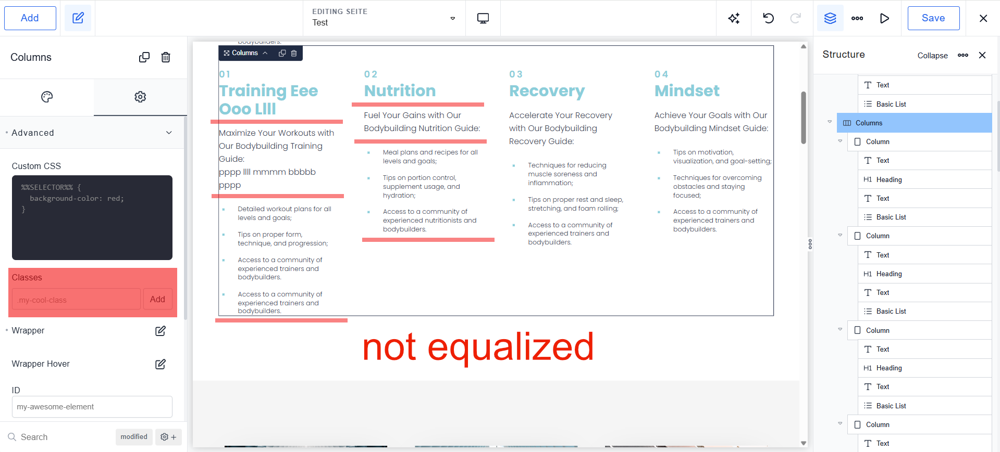
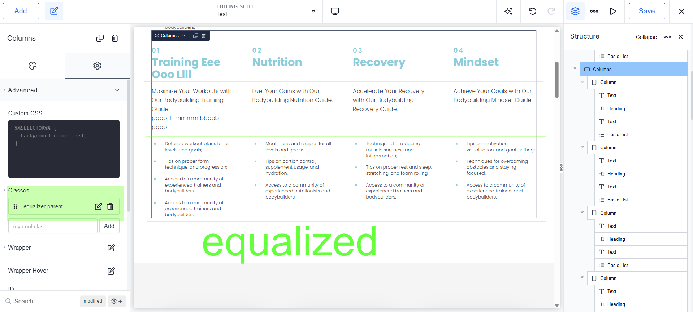

# WP Height Equalizer

**Stop fighting with uneven cards and jagged rows.** WP Height Equalizer is a plug-and-play utility designed to bring flawless visual alignment to your grids and multi-column layouts.

---

## Before & After

| Before | After |
|--------|-------|
|  |  |

---

Unlike blanket scripts, this plugin uses an intelligent **top-down structural approach**. Simply add a single class to your row container, and the plugin automatically maps and synchronizes the inner elements row-by-row based on their exact positional order.

## Key Features

- **Zero Configuration:** No need to add utility classes to every single inner heading or paragraph. Set it on the parent container, and it just works.
- **Intelligent Row-Grouping:** Dynamically calculates which cards are visually in the same row. When layout columns stack vertically on mobile viewports, equalization automatically pauses to maintain standard readability.
- **Built for Page Builders:** Fully optimized for loop-generated structures like Breakdance Repeaters, Elementor Loops, WooCommerce grids, or custom theme templates.
- **Performance Focused:** Extremely lightweight Vanilla JS utility with built-in event debouncing. It automatically disconnects its MutationObserver during style injection to ensure zero layout thrashing or browser freezes.

---

## How It Works & Supported Elements

Add the class `equalizer-parent` to your main layout container (Section, Grid, Row, or Div). The plugin will scan the child cards and synchronize matching elements sequentially (e.g., matching the 1st paragraph across all columns, then the 2nd paragraph, etc.).

### Automatically Supported Elements

| Element | Description |
|---------|-------------|
| `h1`–`h6`, `.bde-heading` | Headings |
| `p`, `.bde-text` | Text blocks |
| `ul`, `ol` | Lists — perfect for lining up features/bullet points |
| `.equalizer-child` | Manually force-sync a custom element |
| `.equalizer-ignore` | Exclude a specific card from calculation |

---

## Supported DOM Structure (Direct Siblings)

The plugin targets grids where every individual card is a **direct sibling** under a single shared parent container. This is how Repeaters, Post Loops, and WooCommerce grids natively output HTML:

```
[equalizer-parent]  (The Grid Container)
  ├── [Card 1] ──> <h3> ──> <p>
  ├── [Card 2] ──> <h3> ──> <p>
  └── [Card 3] ──> <h3> ──> <p>
```

### Unsupported: Nested Column Stacking

Avoid using this on multi-column layouts where cards are stacked vertically inside separate column silos. The DOM structure places them in isolated branches — the plugin cannot match cards across different column elements.

---

## Developer-Friendly Error Logging

The plugin handles structural mismatches gracefully:

- **Soft Fallback:** Skips equalization only for the mismatched element type on that specific row — the rest of the layout still syncs perfectly.
- **Smart DevTools Output:** Prints a detailed structural breakdown to your browser console, pointing to the exact card missing an element.

---

## How to Use

1. **Install & Activate** the plugin from your WordPress dashboard.
2. **Add the class** `equalizer-parent` to your grid/row container.
3. **Done.** The plugin automatically detects and levels your headers, text, and lists on the frontend.

> **Builder Safe:** The script automatically goes dormant when you open backend editors (Breakdance, Elementor, Bricks, Gutenberg) to ensure design environment stability.

---

## Requirements

- WordPress 6.0+
- Tested up to WordPress 6.7

## License

[GPL-2.0+](http://www.gnu.org/licenses/gpl-2.0.txt)
